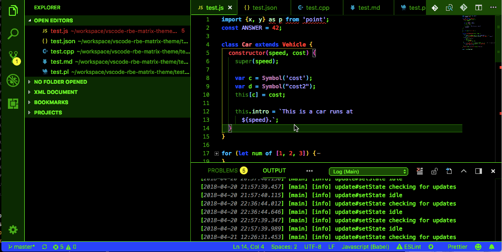

# RBE Matrix theme

This theme is a basic bright green "Matrix"-like theme. However, this design incorporates some reds and blues to make
the syntax easier to digest at a  glance. I am mainly a Ruby on Rails developer, so I have tested this theme thoroughly
on ruby, html, haml, markdown, asciidoc, javascript, SQL, coffeescript, ECMAScript 6 (ES6), and JSON. I have included some
test files in the source code of this syntax plugin, as a test. These were taken from the [highlight.js](http://hightlightjs.org) web site. 

# Base Theme
This theme can be used as a base theme for your next theme, and has been hand-crafted with every available option. You are free to use this theme as a base for your own. For info about all options, see https://code.visualstudio.com/docs/getstarted/theme-color-reference.

# License
This is free and unencumbered software released into the public domain.

Anyone is free to copy, modify, publish, use, compile, sell, or
distribute this software, either in source code form or as a compiled
binary, for any purpose, commercial or non-commercial, and by any
means.

In jurisdictions that recognize copyright laws, the author or authors
of this software dedicate any and all copyright interest in the
software to the public domain. We make this dedication for the benefit
of the public at large and to the detriment of our heirs and
successors. We intend this dedication to be an overt act of
relinquishment in perpetuity of all present and future rights to this
software under copyright law.

THE SOFTWARE IS PROVIDED "AS IS", WITHOUT WARRANTY OF ANY KIND,
EXPRESS OR IMPLIED, INCLUDING BUT NOT LIMITED TO THE WARRANTIES OF
MERCHANTABILITY, FITNESS FOR A PARTICULAR PURPOSE AND NONINFRINGEMENT.
IN NO EVENT SHALL THE AUTHORS BE LIABLE FOR ANY CLAIM, DAMAGES OR
OTHER LIABILITY, WHETHER IN AN ACTION OF CONTRACT, TORT OR OTHERWISE,
ARISING FROM, OUT OF OR IN CONNECTION WITH THE SOFTWARE OR THE USE OR
OTHER DEALINGS IN THE SOFTWARE.

For more information, please refer to http://unlicense.org/
